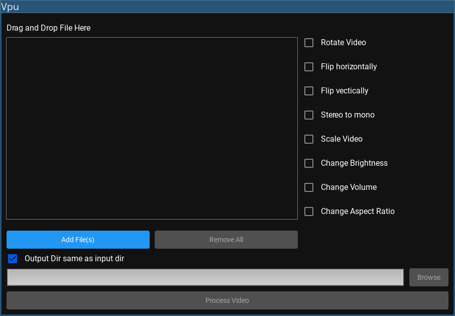

# Screenshot



# Run

# Install Dependency

```
pip install -r requirements.txt
```
Download ffmpeg binaries:- <br>
    [windows](https://github.com/GyanD/codexffmpeg/releases/download/7.1/ffmpeg-7.1-essentials_build.7z) <br>
    [mac](https://evermeet.cx/ffmpeg/ffmpeg-7.1.7z) <br>
    [linux](https://github.com/BtbN/FFmpeg-Builds/releases) <br>

Extract ffmpeg binaries in ffmpeg folder so it should look like below:- <br>

```
ffmpeg
├── ffmpeg.exe
└── ffprobe.exe
```

# Run

```
python main.py

```
